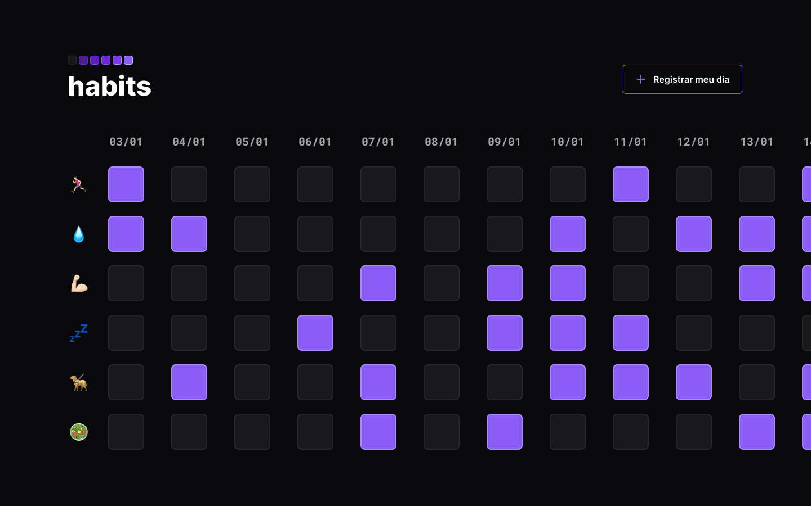

<h1 align="center"> Habits Tracker </h1>

  <a href="#-tecnologias">Tecnologias</a>&nbsp;&nbsp;&nbsp;|&nbsp;&nbsp;&nbsp;
  <a href="#-projeto">Projeto</a>&nbsp;&nbsp;&nbsp;|&nbsp;&nbsp;&nbsp;
  <a href="#-layout">Layout</a>&nbsp;&nbsp;&nbsp;|&nbsp;&nbsp;&nbsp;
  <a href="#memo-licença">Licença</a>

  

  

 

## 🚀 Tecnologias

Esse projeto foi desenvolvido com as seguintes tecnologias:

- HTML5
- CSS3
- JavaScript
- Git e Github

## 💻 Projeto

O Habits é uma aplicação que ajuda no rastramento de hábitos, trazendo uma forma criativa de registrar o seu desempenho.

- [Acesse o projeto finalizado, online]()

---
## :memo: Licença

Esse projeto está sob a licença MIT.

---

Feito com ♥ by Ana Luisa
